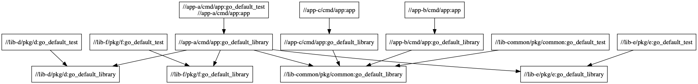

# Go Example "Complex" Project

Example project so I can play with Bazel.

Eventually I wanna make this a microservice architecture, with a couple Go microservices, Docker images, Kubernetes manifests, and Helm charts.



## Useful Links

TODO(zoidbergwill): document how and why we use each of these.

### Bazel Libraries and Tools

- [bazelbuild/rules_go](https://github.com/bazelbuild/rules_go) - Bazel rules for Go
- [bazelbuild/bazel-gazelle](https://github.com/bazelbuild/bazel-gazelle) - gazelle is an awesome tool for working with Go projects in Bazel. It can be extended to support other languages, but is awesome because it generates Bazel BUILD files for you.

- [bazelbuild/rules_docker](https://github.com/bazelbuild/rules_docker) - Bazel rules for creating Docker images
- [bazelbuild/rules_k8s](https://github.com/bazelbuild/rules_k8s) - Bazel rules for Kubernetes manifests
- [tmc/rules_helm](https://github.com/tmc/rules_helm) - Bazel rules for Helm

### Bazel Blog Posts

[JML's Bazel Correct Reproducible Fast Builds](https://jml.io/2015/07/bazel-correct-reproducible-fast-builds.html)
[BrainTreePayments's Migrating from Gradle to Bazel](https://www.braintreepayments.com/blog/migrating-from-gradle-to-bazel/)

## Pretty things

```
# bazel test '...'

INFO: Analyzed 15 targets (10 packages loaded, 117 targets configured).
INFO: Found 10 targets and 5 test targets...
INFO: Elapsed time: 2.218s, Critical Path: 0.36s
INFO: 10 processes: 10 darwin-sandbox.
INFO: Build completed successfully, 14 total actions
//app-a/cmd/app:go_default_test                                          PASSED in 0.1s
//lib-common/pkg/common:go_default_test                                  PASSED in 0.2s
//lib-d/pkg/d:go_default_test                                            PASSED in 0.1s
//lib-e/pkg/e:go_default_test                                            PASSED in 0.2s
//lib-f/pkg/f:go_default_test                                            PASSED in 0.1s

Executed 5 out of 5 tests: 5 tests pass.
There were tests whose specified size is too big. Use the --test_verbose_timeout_warnings command line option to see wINFO: Build completed successfully, 14 total actions
```

After editing app:

```
# bazel test '...'
INFO: Analyzed 15 targets (1 packages loaded, 5 targets configured).
INFO: Found 10 targets and 5 test targets...
INFO: Elapsed time: 1.632s, Critical Path: 1.39s
INFO: 6 processes: 6 darwin-sandbox.
INFO: Build completed successfully, 7 total actions
//lib-common/pkg/common:go_default_test                         (cached) PASSED in 0.2s
//lib-d/pkg/d:go_default_test                                   (cached) PASSED in 0.1s
//lib-e/pkg/e:go_default_test                                   (cached) PASSED in 0.2s
//lib-f/pkg/f:go_default_test                                   (cached) PASSED in 0.1s
//app-a/cmd/app:a_test                                                   PASSED in 0.5s

Executed 1 out of 5 tests: 5 tests pass.
There were tests whose specified size is too big. Use the --test_verbose_timeout_warnings command line option to see wINFO: Build completed successfully, 7 total actions
```
