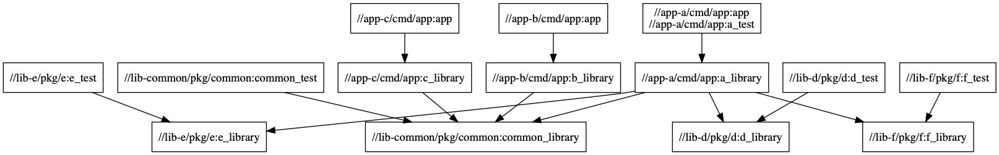

# Go Example "Complex" Project

Example project so I can play with Bazel.

Eventually I wanna make this a microservice architecture, with a couple Go microservices, Docker images, Kubernetes manifests, and Helm charts.

## Useful Links

TODO(zoidbergwill): document how and why we use each of these.

https://github.com/bazelbuild/rules\_go
https://github.com/bazelbuild/bazel-gazelle
https://github.com/bazelbuild/rules\_docker
https://github.com/bazelbuild/rules\_k8s
https://github.com/tmc/rules\_helm

https://jml.io/2015/07/bazel-correct-reproducible-fast-builds.html
https://www.braintreepayments.com/blog/migrating-from-gradle-to-bazel/
